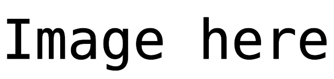

# District heating potential and cost

In this module district heating potentials and costs are calculated using the approach from Fallahnejad et al. 2024.

<!-- Place an attractive image of module outputs here -->
<p align="center">
  
</p>


## About
<!-- Please do not modify this templated section -->

This is a modular `snakemake` workflow created as part of the [Modelblocks project](https://www.modelblocks.org/). It can be imported directly into any `snakemake` workflow.

For more information, please consult the Modelblocks [documentation](https://modelblocks.readthedocs.io/en/latest/),
the [integration example](./tests/integration/Snakefile),
and the `snakemake` [documentation](https://snakemake.readthedocs.io/en/stable/snakefiles/modularization.html).

## Overview
<!-- Please describe the processing stages of this module here -->

Data processing steps:

1. Download the published Hotmaps residential and non-residential heated gross floor-area rasters.
2. Validate their 100 m ETRS89-LAEA grid and combine them into a three-band GeoTIFF with residential, non-residential, and total floor area.

## Configuration
<!-- Please describe how to configure this module below -->

Please consult the configuration [README](./config/README.md) and the [configuration example](./config/config.yaml) for a general overview on the configuration options of this module.

## Input / output structure
<!-- Please describe input / output file placement below -->

Please consult the [interface file](./INTERFACE.yaml) for more information.

## Development
<!-- Please do not modify this templated section -->

We use [`pixi`](https://pixi.sh/) as our package manager for development.
Once installed, run the following to clone this repository and install all dependencies.

```shell
git clone git@github.com:modelblocks-org/module_district_heating.git
cd module_district_heating
pixi install --all
```

Please be aware that this is a multi-environment project (see [pixi.toml](./pixi.toml) for details).
- `default`: used for development and integration testing.
Because it contains `Snakemake`, `conda` and `pytest` as dependencies it **should not be used** in `Snakemake` rules.
- `module`: contains minimal dependencies used in `Snakemake` rules.
If modified, be sure to export it to `Snakemake` so it can be recreated by module users:

```shell
# create module.yaml and conda-spec pin files in workflow/envs/
pixi run export-snakemake-env module
```


## Testing
<!-- Please do not modify this templated section -->

For testing, simply run:

```shell
pixi run test-integration
```

To test a minimal example of a workflow using this module:

```shell
pixi shell    # activate this project's environment
cd tests/integration/  # navigate to the integration example
snakemake --use-conda --cores 2  # run the workflow!
```

## References
<!-- Please provide thorough referencing below -->

This module is based on the following research and datasets:

* Müller, A., Hummel, M., Kranzl, L., Fallahnejad, M., & Büchele, R. (2019). [Open Source Data for Gross Floor Area and Heat Demand Density on the Hectare Level for EU 28](https://doi.org/10.3390/en12244789). *Energies*, 12(24), 4789.
* [Hotmaps residential heated gross floor-area density](https://gitlab.com/hotmaps/buildings/gfa_res_curr_density), CC BY 4.0.
* [Hotmaps non-residential heated gross floor-area density](https://gitlab.com/hotmaps/buildings/gfa_nonres_curr_density), CC BY 4.0.

## Contributors ✨

Thanks goes to these wonderful people, sorted alphabetically ([emoji key](https://allcontributors.org/en/reference/emoji-key/)):

<!-- ALL-CONTRIBUTORS-LIST:START - Do not remove or modify this section -->
<!-- prettier-ignore-start -->
<!-- markdownlint-disable -->
<!-- markdownlint-restore -->
<!-- prettier-ignore-end -->
<!-- ALL-CONTRIBUTORS-LIST:END -->

This project follows the [all-contributors](https://github.com/all-contributors/all-contributors) specification. Contributions of any kind welcome!
